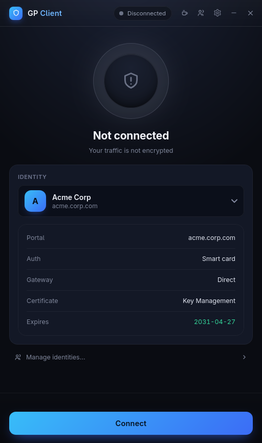
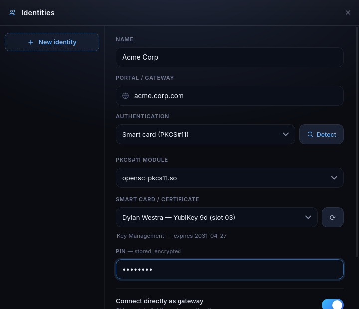
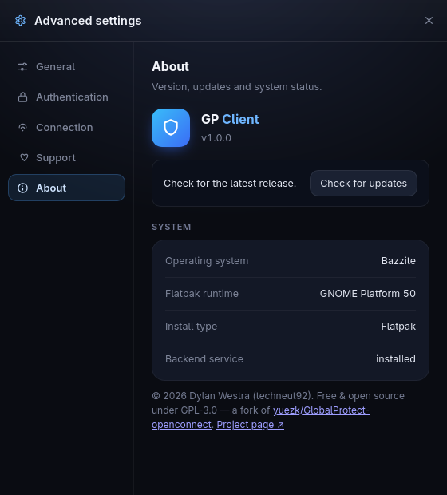
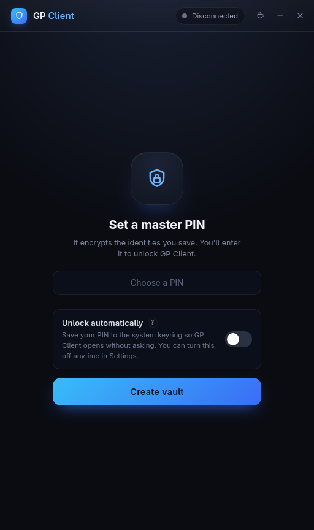
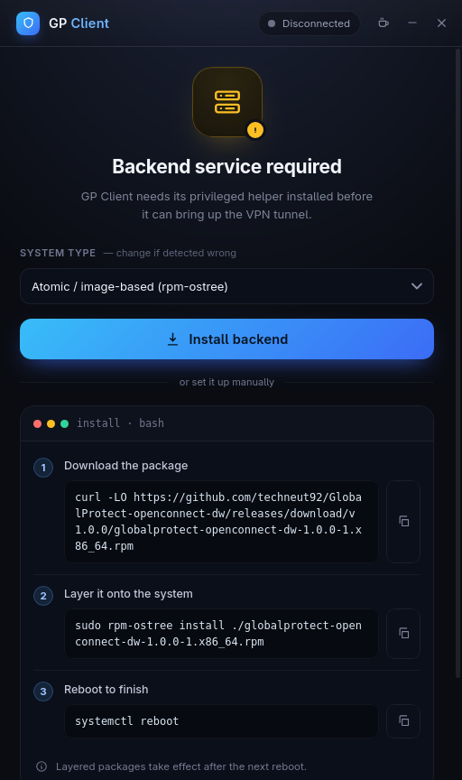
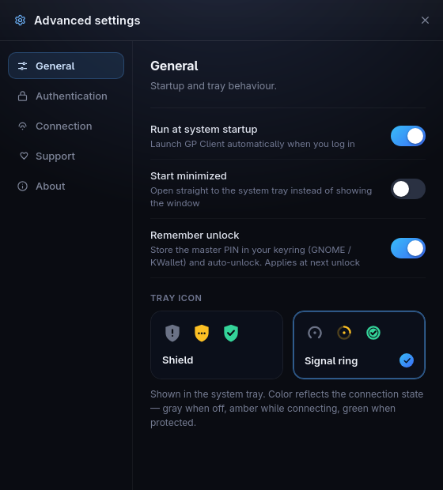

# GP Client

[](https://copr.fedorainfracloud.org/coprs/techneut92/globalprotect-openconnect-dw/package/globalprotect-openconnect-dw/)
[](./LICENSE)

A GlobalProtect-compatible VPN client for Linux with **smart-card / PKCS#11
(YubiKey PIV) certificate authentication** — alongside SAML single sign-on and
username/password. Built on [OpenConnect](https://www.infradead.org/openconnect/),
it ships a command-line client and a graphical app (**GP Client**).

A fork of [yuezk/GlobalProtect-openconnect](https://github.com/yuezk/GlobalProtect-openconnect),
**fully open source under the GPL-3.0** (the upstream GUI was proprietary; this
GUI is a clean, open Tauri rewrite).

> **GlobalProtect** is a trademark of Palo Alto Networks. This is an independent,
> compatible client and is not affiliated with or endorsed by Palo Alto Networks.

<p align="center">
  
</p>
<p align="center"><em>Connect with a smart-card (PKCS#11 / YubiKey PIV) identity.</em></p>

<details>
<summary><b>More screenshots</b></summary>

<p align="center">
  
  
</p>
<p align="center"><em>Identity manager (PKCS#11 / YubiKey) · About (host OS, Flatpak runtime, backend status).</em></p>

<p align="center">
  
  
  
</p>
<p align="center"><em>Encrypted vault · guided backend install · settings.</em></p>

</details>

## Contents

- [Quickstart](#quickstart)
- [Features](#features)
- [Install](#install)
- [Usage](#usage)
- [Building from source](#building-from-source)
- [Distribution roadmap](#distribution-roadmap)
- [License](#license)

## Quickstart

Install — or update — GP Client to the latest release with one command, then run it:

```bash
curl -fLO https://github.com/techneut92/GlobalProtect-openconnect-dw/releases/latest/download/io.github.techneut92.gpgui.flatpak \
  && flatpak install --user --or-update --assumeyes io.github.techneut92.gpgui.flatpak
flatpak run io.github.techneut92.gpgui
```

The download URL always points at the newest release, so **re-running the first
command updates** you to the latest version (keeping your vault and settings) —
`--or-update` installs it the first time and updates it after. The app can also
update itself from its About page.

That's the whole GUI. On first launch the app guides you through the rest —
installing the backend service (with the exact command for your distro), creating
your encrypted vault, and adding an identity.

**CLI only?** The `gpclient` command ships with the backend package — skip the
Flatpak and follow the [Install](#install) instructions below.

## Features

- **Smart-card / PKCS#11 auth** — YubiKey PIV (or any PKCS#11 token) client
  certificate for portal *and* gateway login.
- **SAML SSO** — embedded webview in the GUI (in-process), or the system browser —
  plus username/password.
- **Encrypted identity vault** — save multiple connections, optionally unlocked
  from your keyring (GNOME Keyring / KWallet / COSMIC).
- **System tray** with state-aware icons, connect-from-tray, and notifications.
- **CLI and GUI** — the CLI (`gpclient`) is fully scriptable; the GUI (GP Client)
  is an unprivileged app that drives a small privileged host service.
- Multi-portal / direct-gateway, start at login (minimized to the tray).

## Install

GP Client is distributed via **[GitHub Releases](https://github.com/techneut92/GlobalProtect-openconnect-dw/releases)**.
It has two parts:

| Part | What it is | How to get it |
|------|------------|---------------|
| **GP Client** (GUI) | The unprivileged app | `.flatpak` bundle (recommended) |
| **Backend service** | Privileged, **webkit-free** helper that brings up the tunnel (`gpservice` + `gpclient` + `gpauth`) | host package (`.rpm`/`.deb`/`.pkg.tar.zst`/`.apk`) |

The GUI talks to the backend over D-Bus, so the backend must be a **host
package** (it needs root + the TUN device). The app's "backend not installed"
screen shows the exact command for your distro.

### GUI — Flatpak (any distro)

The graphical client runs anywhere as a Flatpak:

```bash
curl -fLO https://github.com/techneut92/GlobalProtect-openconnect-dw/releases/latest/download/io.github.techneut92.gpgui.flatpak
flatpak install --user --or-update --assumeyes io.github.techneut92.gpgui.flatpak
flatpak run io.github.techneut92.gpgui
```

The **backend service** is a host package — find your distro below.

---

### Fedora

Install (and auto-update) from COPR:

```bash
sudo dnf copr enable techneut92/globalprotect-openconnect-dw
sudo dnf install globalprotect-openconnect-dw
sudo dnf install globalprotect-openconnect-dw-gui   # optional native (non-Flatpak) GUI
```

**Atomic** (Silverblue / Kinoite / Bazzite / Bluefin — no `dnf copr`): add the repo
file, layer it, and reboot:

```bash
fed=$(rpm -E %fedora)
sudo curl -fsSL -o /etc/yum.repos.d/_copr_techneut92-gpoc-dw.repo \
  "https://copr.fedorainfracloud.org/coprs/techneut92/globalprotect-openconnect-dw/repo/fedora-$fed/techneut92-globalprotect-openconnect-dw-fedora-$fed.repo"
rpm-ostree install globalprotect-openconnect-dw   # add -gui for the native GUI
systemctl reboot
```

Or grab the `.rpm` from the
[release](https://github.com/techneut92/GlobalProtect-openconnect-dw/releases):

```bash
sudo dnf install ./globalprotect-openconnect-dw-*.rpm
```

---

### RHEL / AlmaLinux / Rocky / CentOS Stream 10

The same COPR repo builds for Enterprise Linux 10 via EPEL:

```bash
sudo dnf install epel-release
sudo dnf copr enable techneut92/globalprotect-openconnect-dw
sudo dnf install globalprotect-openconnect-dw
```

Or a manual `.rpm` from the
[release](https://github.com/techneut92/GlobalProtect-openconnect-dw/releases):

```bash
sudo dnf install ./globalprotect-openconnect-dw-*.rpm
```

> EL **9** isn't built — its Rust (1.84) is older than the dependency tree needs
> (≥ 1.88). Use the Flatpak GUI on EL 9.

---

### Debian / Ubuntu

**Ubuntu 26.04** — install (and auto-update) from the apt repo:

```bash
. /etc/os-release   # uses VERSION_ID, e.g. 26.04
sudo mkdir -p /etc/apt/keyrings
curl -fsSL "https://download.opensuse.org/repositories/home:Techneut92:gp-client/xUbuntu_$VERSION_ID/Release.key" \
  | gpg --dearmor | sudo tee /etc/apt/keyrings/gp-client.gpg >/dev/null
echo "deb [signed-by=/etc/apt/keyrings/gp-client.gpg] https://download.opensuse.org/repositories/home:Techneut92:gp-client/xUbuntu_$VERSION_ID/ /" \
  | sudo tee /etc/apt/sources.list.d/gp-client.list
sudo apt update && sudo apt install globalprotect-openconnect-dw
```

**Any other Debian/Ubuntu** — download the `.deb` from the
[release](https://github.com/techneut92/GlobalProtect-openconnect-dw/releases) and
install it directly. The prebuilt package runs on **Debian 12+ and Ubuntu 22.04+**
(glibc ≥ 2.34):

```bash
sudo apt install ./globalprotect-openconnect-dw_*.deb
```

> Only Ubuntu 26.04 has an apt repo (its Rust is new enough to build from
> source); on older Debian/Ubuntu use the manual `.deb` or the Flatpak GUI for
> auto-updates.

---

### Arch

```bash
sudo pacman -U ./globalprotect-openconnect-dw-*.pkg.tar.zst
```

---

### Alpine

```bash
sudo apk add --allow-untrusted ./globalprotect-openconnect-dw-*.apk
```

---

A `…-gui` package and a generic `…bin.tar.xz` are attached to every release for a
fully native (non-Flatpak) install.

## Usage

### Graphical (GP Client)

Launch it from your application menu, or:

```bash
flatpak run io.github.techneut92.gpgui      # Flatpak
gpgui                                        # native install
```

Create a vault, add an identity (portal + auth method / PKCS#11 module), and
connect. Manage saved identities and advanced options from the in-app Settings.

### Command line (`gpclient`)

```
Usage: gpclient [OPTIONS] <COMMAND>

Commands:
  connect     Connect to a portal server
  disconnect  Disconnect from the server
  launch-gui  Launch the GUI
  help        Print this message or the help of the given subcommand(s)
```

External-browser SSO:

```bash
sudo -E gpclient connect --browser <portal>
# or, piping the cookie:
gpauth <portal> --browser 2>/dev/null | sudo gpclient connect <portal> --cookie-on-stdin
```

Use `--browser remote` on headless hosts to get a URL you complete elsewhere.

## Building from source

### GUI (Flatpak)

```bash
apps/gpgui/packaging/flatpak/flatpak-build.sh
```

This installs the GNOME 50 runtime/SDK, vendors the cargo registry, and builds
`io.github.techneut92.gpgui` via flatpak-builder (needs `flatpak` +
`flatpak-builder`; on atomic Fedora: `flatpak install flathub org.flatpak.Builder`).

### CLI + backend + native GUI

Prerequisites: [Rust 1.89+](https://www.rust-lang.org/tools/install), Tauri
deps, and OpenConnect build deps (`autoconf`, `automake`, `libtool`,
`pkg-config`, `libxml2`, `gnutls`, `p11-kit`, `nettle`, `gmp`, `zlib`, `lz4`
dev packages), plus `pkexec` and `gnome-keyring`/`pam_kwallet`.

```bash
git clone https://github.com/techneut92/GlobalProtect-openconnect-dw.git
cd GlobalProtect-openconnect-dw
git submodule update --init --recursive
make build           # or: cargo build --release -p gpclient -p gpservice -p gpauth -p gpgui
sudo make install
```

Build options: `OFFLINE=1` (vendored deps). A DevContainer
(`.devcontainer/`) is provided for a reproducible toolchain.

## Distribution roadmap

Release artifacts are produced automatically by CI on each `vX.Y.Z` tag
(`.github/workflows/build.yaml`) and attached to the GitHub release. Wider
distribution channels to set up as the project matures:

- [x] **GitHub Releases** — `.rpm` / `.deb` / `.pkg.tar.zst` / `.apk` / `.bin.tar.xz` + `.flatpak` bundle
- [ ] **Flathub** — submit `io.github.techneut92.gpgui` (AppStream metainfo is in
      `apps/gpgui/packaging/flatpak/`)
- [x] **Fedora COPR** — backend + native `-gui` `.rpm`, built & published from the
      release pipeline (gated on the RPM install test). Live:
      `dnf copr enable techneut92/globalprotect-openconnect-dw`. Also covers
      RHEL / AlmaLinux / Rocky / CentOS where their Rust is new enough (see note).
- [ ] **Arch AUR** — backend + GUI
- [ ] **Debian/Ubuntu PPA / openSUSE OBS** — *constrained:* the dependency tree
      needs **Rust ≥ 1.88**, so source-build services only work on distros that
      ship a recent Rust (Fedora, openSUSE Tumbleweed, the newest EL/Ubuntu).
      Debian ≤13, Ubuntu LTS, and EL9 ship older Rust and can't build from source
      — those users should use the **Flatpak** or the prebuilt `.deb`/`.rpm` from
      GitHub Releases.
- [ ] **NixOS flake** — `flake.nix` builds the whole workspace (incl. GUI) from
      source and is checked in CI (`.github/workflows/nix.yaml`); use the git
      fetcher so the submodules come along (the `github:` shorthand omits them):
      `nix build 'git+https://github.com/techneut92/GlobalProtect-openconnect-dw?submodules=1#default'`
- [ ] **Docker image** — CLI-only (`gpclient`/`gpauth`); CI job present, publish disabled

## Support

If this project saves you some time, you can support its development on Ko-fi:

[](https://ko-fi.com/techneut92)

## License

**GPL-3.0-or-later.** © 2026 Dylan Westra (techneut92). A fork of
[yuezk/GlobalProtect-openconnect](https://github.com/yuezk/GlobalProtect-openconnect)
(GPL-3.0). See [LICENSE](./LICENSE) and [CHANGES.md](./CHANGES.md) (GPLv3 §5a
change notices).

| Component | License |
|-----------|---------|
| [gpgui](./apps/gpgui) (GP Client GUI) | [GPL-3.0](./apps/gpgui/LICENSE) |
| [gpservice](./apps/gpservice) | [GPL-3.0](./apps/gpservice/LICENSE) |
| [gpclient](./apps/gpclient) | [GPL-3.0](./apps/gpclient/LICENSE) |
| [gpauth](./apps/gpauth) | [GPL-3.0](./apps/gpauth/LICENSE) |
| [gpapi](./crates/gpapi) · [common](./crates/common) · [auth](./crates/auth) · [openconnect](./crates/openconnect) | [GPL-3.0](./LICENSE) |

The Flatpak additionally bundles **pcsc-lite** (BSD-3-Clause) and **OpenSC**
(LGPL-2.1+), built from upstream source; their license texts ship in
`/app/share/licenses/`.
